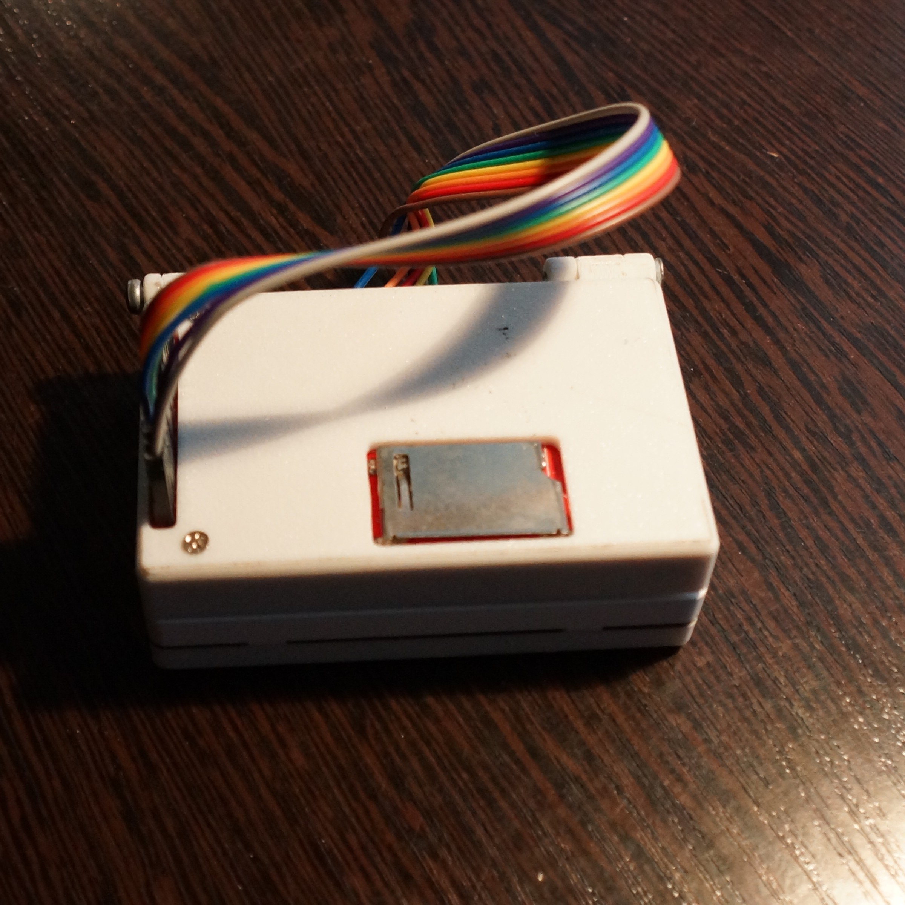
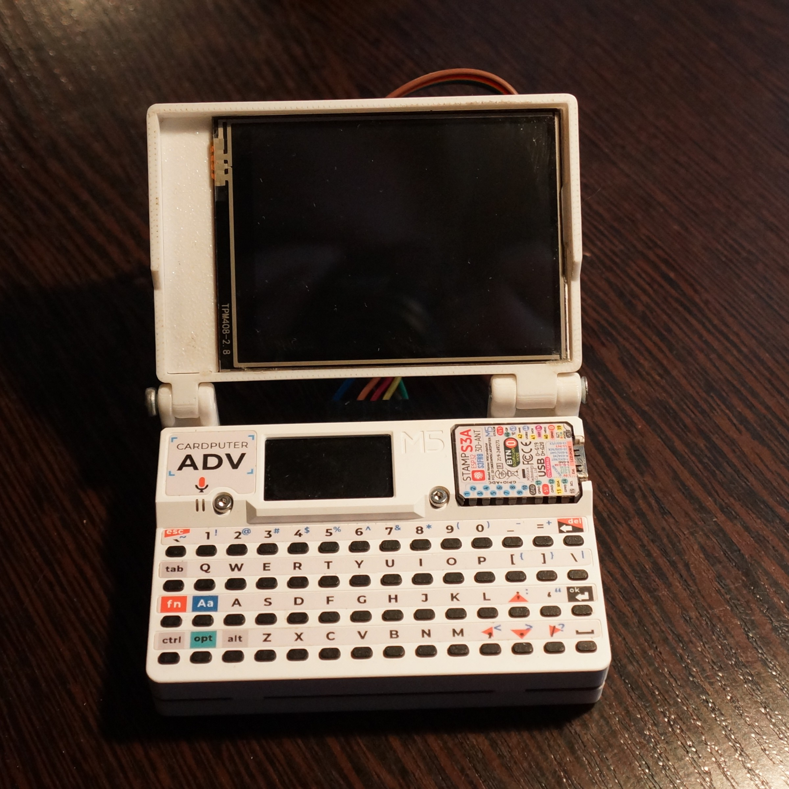
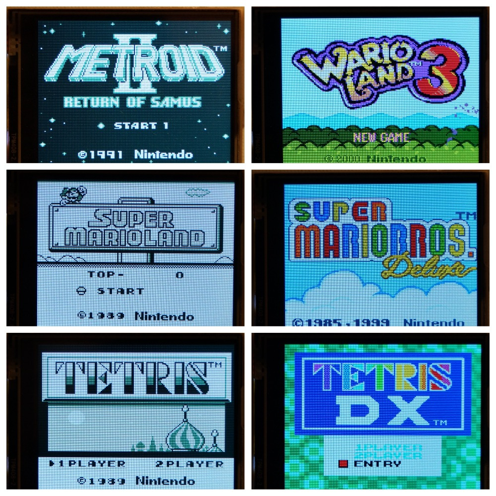
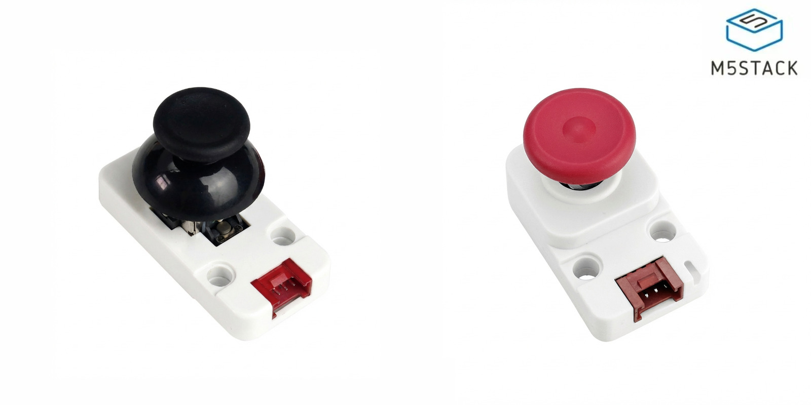
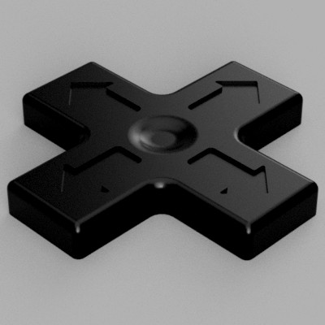

# Cardputer-Game-Boy-Color







It runs ** `.gb` `.gbc`  ROM files from the SD**.

> **Make sure your ROMs are uncompressed** (not .zip, .7z, or .rar).

# Hardware Requirements

- M5Stack Cardputer-Adv (ESP32-S3)  
- 2.8" ILI9341 SPI Display Module (320x240)  
- SD Card (FAT32) with ZX Spectrum games  

# Wiring: Cardputer-Adv EXT Connector → ILI9341

| ILI9341 Pin | EXT Pin | GPIO | Description    |
|---|---|---|---|
| VCC    | PIN 15  | -    | 3.3V Power    |
| GND    | PIN 11  | -    | Ground    |
| CS    | PIN 13  | G5    | Chip Select    |
| RST/RESET   | PIN 1   | G3    | Reset    |
| DC/RS    | PIN 5   | G6    | Data/Command    |
| SDI/MOSI    | PIN 9   | G14   | SPI Data In    |
| SCK/CLK    | PIN 7   | G40   | SPI Clock    |
| LED/BLK    | -    | -    | Backlight (connect to VCC or use PWM) |
| SDO/MISO    | -    | -    | Not used    |

**Note:** The display and SD card share the SPI bus (SPI3_HOST). SD card CS is on GPIO 12.


## 🛠️ Build & Upload via VS Code + PlatformIO

### 1. Install Requirements
- **Visual Studio Code**
- **PlatformIO IDE** extension (install from VS Code marketplace)

### 2. Get the code
```bash
git clone https://github.com/eghor2005/Cardputer-Game-Boy-Color.git
```
Then open the cloned folder in VS Code.

### 3. Build the firmware
- In the **PlatformIO toolbar** (blue bar at the bottom), click the **`✓` (checkmark)** icon
- Or run in terminal:
```bash
pio run
```

### 4. Upload to Cardputer
1. Connect your **M5Stack Cardputer** via USB
2. Click the **`→` (right arrow)** icon in the PlatformIO toolbar
3. Or run:
```bash
pio run --target upload
```

### 5. Monitor (optional)
Click the **`⤒` (plug)** icon to view serial output.

---


## Controls

The built-in **Cardputer keyboard** is used for all controls: 

| Function | Cardputer Key | Description |
|---------------|---------------|-------------|
| 🕹️ Up | **E** | Move up |
| 🕹️ Down | **S** | Move down |
| 🕹️ Left | **A** | Move left |
| 🕹️ Right | **D** | Move right |
| 🅰️ Button A | **K** | Primary action / confirm |
| 🅱️ Button B | **L** | Secondary action / cancel |
| ▶️ Start | **1** | Start / pause |
| ⏸️ Select | **2** | Select / menu |
| 💡 Brightness + | **]** | Increase LCD brightness |
| 💡 Brightness − | **[** | Decrease LCD brightness |
| 🔊 Volume + | **+** | Increase audio volume |
| 🔊 Volume − | **-** | Decrease audio volume |
| 🖥️ Screen Mode | **\\** | Toggle screen display mode |
| 🔍 Zoom − | **Fn + ←** | Zoom out |
| 🔍 Zoom + | **Fn + →**| Zoom in |
| 🔘 Quit Game | **G0 (hold 1 s)** | Go back to menu |

> The `j` key is also bound as Button A to allow an alternative layout for player preference.

> The `z` key is also bound as Arrow Down to allow the use of a D-PAD.

> On the MSX emulator, press `FN+key` to type normal keyboard keys instead of joystick inputs.

## M5Stack Joystick

You can alternatively use the M5Stack Joystick v1.1 (U024-C) or Joystick2 (U024-V2), **just plug it in before launching a game** and it will work automatically.



## D-Pad 3D Model

[Cardputer-Accessories repo](https://github.com/AndreiVladescu/Cardputer-Accessories) to get the 3D model for D-Pad that you can put on the Cardputer's keys. (Thanks to @AndreiVladescu)

[](https://github.com/AndreiVladescu/Cardputer-Accessories)

## Zoom Mode

The Zoom Mode allows you to **dynamically adjust the display scale of games** on the Cardputer’s screen.

By pressing `\` (above the `OK` key), you can toggle between **multiple zoom levels (100 to 150%), fullscreen or 4/3**. This flexibility ensures that each game looks its best on the Cardputer’s compact display. 

> In the SNES emulator, pressing `\` toggles between adaptive interlaced and lower-resolution modes for better performance.

> in the GameBoy (not color) emulator, pressing `\` toggles between different color palettes.

You can precisely adjust the display zoom level with `fn` + `arrows left/right`.

## About Games

You can place the **ROM uncompressed files** anywhere on your SD card and select them. The firmware allows running ROMs up to 5.5 MB.

> **⚠️ Avoid having more than 512 ROMs per folder** to prevent loading times.

When browsing your game list, you can **type the first few letters of a game’s name** to jump directly to it. This makes it much faster to find a specific title, especially when your library contains dozens of entries.

## About Saves

Save files are created automatically and organized into separate folders per console on your SD card. **Each save is linked to the game’s filename**.

> **⚠️ The autosave system writes to the SD card in the background at regular intervals.**

The chance of corrupting a save by resetting the device exactly at the moment a write occurs is low. However, to completely eliminate this risk, it is recommended to exit games properly.

Hold the **GO button for 1 second to quit safely** and ensure no save corruption.

## Launcher

For [Launcher](https://github.com/bmorcelli/Launcher)'s users, you can now use the **“Game Station” partition** scheme to load ROMs larger than 1MB.

> In the Launcher main menu, Go to **CFG → Partition Change, and select Game Station.**

The firmware can also automatically switch the device to the “Game Station” partition scheme in order to load ROMs larger than 1 MB.

When you try to run a ROM that needs more space (up to 4 MB):

- The firmware checks that it is running under the Launcher.
- If needed, it asks to flash the Game Station partition table.
- The device reboots once to apply the new layout.

After the reboot, you can load larger ROMs normally, without any extra steps.
